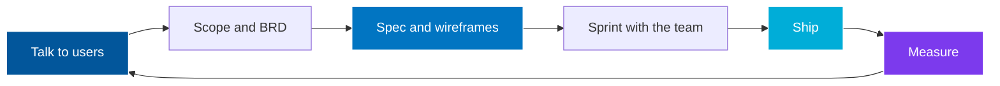

<div align="center">
  
</div>

<h1 align="center">
  <a href="https://git.io/typing-svg">
    
  </a>
</h1>

<div align="center">
  <a href="https://linkedin.com/in/swapnaneel-sarkar"></a>
  <a href="https://swapnaneelsarkar.web.app"></a>
  <a href="mailto:swapnaneel.devwork@gmail.com"></a>
  
</div>

<div align="center">
  
</div>

---

## About Me


**Technical Product Manager at Heizen.** I ship products, not decks.

My work lives in supply chain and procurement software: sourcing, purchase orders, goods receipts, supplier quality, landed cost, CPQ and quoting. Lately I build agentic AI layers that sit on top of those ERPs and turn raw alerts into decisions someone can actually act on.

I also write the code. Python, TypeScript, Flutter. That means my specs get trusted, my estimates land, and I can review the PR that implements them.

**Currently building:** an agentic control layer for supply chain ERPs that never writes back without a human saying yes.

CS and Business Systems @ VIT-AP · CGPA 8.19

<br clear="right">

---

## By The Numbers

<div align="center">

| | |
|---|---|
| **15+** client engagements owned | **$250k+** project value in 1 year |
| **INR 15 to 30 lakhs/year** saved for 3+ clients | **0 to 1** on multiple products |
| **5 verticals**: supply chain, ERP, procurement, workforce, SaaS | **1,000+** Play Store downloads shipped |

</div>

---

## How I Work



Discovery first, then clarity, then code review, then numbers. The loop only counts if the last step feeds the first.

---

## Featured Projects

<div align="center">
<table>
  <tr>
    <td width="50%" valign="top">
      <h3 align="center">Supply Chain Control Layer</h3>
      <div align="center">
        
        
      </div>
      <br>
      <p align="center"><strong>Python · React · PostgreSQL · LLM APIs</strong></p>
      <p>An agentic layer that sits on an existing supply chain ERP. It reads the host system's alerts, attaches the money at stake, explains the exception in plain English, drafts the action and routes it to the role that owns it. Nothing writes back until a human approves.</p>
      <p>Two design calls I am proud of: every money figure is computed in Python so the LLM can only word the numbers, never invent them. And a coverage gate keeps a rule switched off wherever that deployment's data cannot support it, instead of shipping confident noise.</p>
    </td>
    <td width="50%" valign="top">
      <h3 align="center">Vorizon</h3>
      <div align="center">
        <a href="https://vorizon.vercel.app/"></a>
        
      </div>
      <br>
      <p align="center"><strong>React · TypeScript · Node.js · MongoDB · Retell AI · Claude</strong></p>
      <p>A platform to build, train, test and deploy AI employees that handle real business calls, inbound and outbound. Billed on usage at $0.10 per conversation minute with automatic metering.</p>
      <p>Built like a business, not a demo: TCPA consent tracking, Do-Not-Call enforcement, recording disclosure, role-based access, rate limiting and audit logs. The voice engine is swappable so no vendor owns the product.</p>
    </td>
  </tr>
  <tr>
    <td width="50%" valign="top">
      <h3 align="center">MindMark</h3>
      <div align="center">
        <a href="https://github.com/SwapnaneelSarkar/MindMark"></a>
        
      </div>
      <br>
      <p align="center"><strong>Next.js 14 · TypeScript · Supabase · Groq · Llama 3.3 70B</strong></p>
      <p>Captures your mental context at the exact moment you get interrupted, then writes you an AI re-entry brief when you come back. You resume the work instead of rebuilding it.</p>
      <p>Three metrics were set before a line of code: capture under 200ms, brief quality, habit formation. Everything shipped had to move one of them. Voice or text capture, offline PWA, 5 free saves before sign-up.</p>
    </td>
    <td width="50%" valign="top">
      <h3 align="center">CodeContext CLI</h3>
      <div align="center">
        <a href="https://github.com/SwapnaneelSarkar/codecontext"></a>
        
      </div>
      <br>
      <p align="center"><strong>TypeScript · Node.js · Tree-sitter · Turborepo · LLM APIs</strong></p>
      <p>Indexes a local codebase into a compact context bundle: per-file summaries, dependency graphs and agent-ready markdown, so AI coding assistants can navigate a large repo on far fewer tokens.</p>
      <p>Ollama runs as the default backend so there is zero API key friction on first use, with Anthropic and OpenAI as opt-in. Content-hash manifests keep re-indexing cheap on big repos.</p>
    </td>
  </tr>
</table>
</div>

---

## Experience

**Technical Product Manager** · Heizen · Hyderabad
`Intern: Nov 2025 to Jun 2026` `Full-time: Jul 2026 to Present`

Own delivery from discovery to launch on 15+ concurrent engagements across supply chain, ERP, procurement, workforce management and AI, covering $250k+ in project value in a year. Scoped an end-to-end SCM platform running sourcing through reverse GRN with quality scoring and landed cost. Defined module scope for a B2B procurement and corporate gifting platform. Sized and scoped a CPQ product with an admin config portal and a role-based quoting portal. Saved 3+ clients INR 15 to 30 lakhs a year by killing manual workflows.

**Project Manager and App Developer** · Crowdbuzz · Remote
`Apr 2025 to Oct 2025`

Led the product lifecycle across client projects, coordinated designers and engineers, turned business goals into roadmaps and specs. 100% client satisfaction on delivered work.

<details>
<summary><b>Earlier engineering roles</b> (the reason my specs get trusted)</summary>

<br>

**Flutter Developer Intern** · Meet & More · Remote · `Apr 2025 to Oct 2025`
End-to-end mobile apps with Flutter, BLoC, REST APIs, real-time chat and Firebase Cloud Messaging.

**Software Engineer Intern** · Taxian · Remote · `Mar 2025 to Apr 2025`
Flutter web applications with Stripe and PayPal payment flows for live transactions.

**Android Developer Intern** · Apps AiT · Remote · `Sep 2024 to Mar 2025`
Flutter and Firebase apps in an Agile team. Contributed to products that crossed 1,000+ Play Store downloads, plus ML model integration and cloud storage.

</details>

---

## Skills

<details open>
<summary><b>Product</b></summary>
<br>


</details>

<details open>
<summary><b>Supply Chain & ERP Domain</b></summary>
<br>


</details>

<details>
<summary><b>AI & LLM</b></summary>
<br>


</details>

<details>
<summary><b>Engineering</b></summary>
<br>


</details>

---

## GitHub Stats

<div align="center">
  
  
</div>

<div align="center">
  
  
</div>

<div align="center">
  
</div>

---

## Connect

<div align="center">
  <a href="mailto:swapnaneel.devwork@gmail.com">
    
  </a>
  <a href="https://linkedin.com/in/swapnaneel-sarkar">
    
  </a>
  <a href="https://swapnaneelsarkar.web.app">
    
  </a>
</div>

```python
# Not your average PM
class SupplyChainPM(Engineer):
    superpower = "I read your codebase and your users' minds"

    def loop(self):
        while True:
            self.talk_to_users()        # discovery first
            self.write_the_spec()       # then clarity
            self.review_the_pr()        # yes, PMs can do that
            self.ship()                 # end to end ownership
            self.measure()              # 15+ clients, $250k+, INR 15 to 30L saved

            if not self.coffee:
                self.refill()
```

<div align="center">
  
</div>
